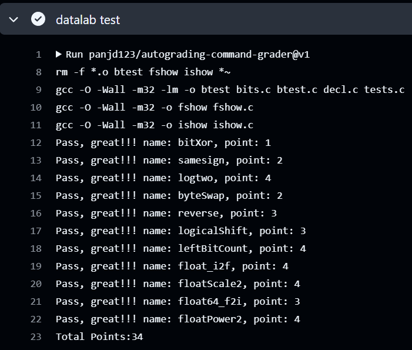

# datalab 报告

姓名：李纪仪

学号：2022201543

| 总分 | bitXor | samesign | logtwo | byteSwap | reverse | logicalShift | leftBitCount | float_i2f | floatScale2 | float64_f2i | floatPower2 |
| ---- | ------ | ------ | -------- | ------- | ------- | - | - | - | - | - | - |
| 34  | 1     | 2        | 4      | 2        | 3 | 3 | 4 | 4 | 4 | 3 | 4 |

test 截图：



<!-- TODO: 用一个通过的截图，本地图片，放到 imgs 文件夹下，不要用这个 github，pandoc 解析可能有问题 -->

## 解题报告

### 亮点

<!-- 告诉助教哪些函数是你实现得最优秀的，比如你可以排序。不需要展开，展开请放到后文中。 -->

#### samesign

- 注意到0既不是正数、也不是负数
- 调整条件判断顺序，减少条件判断和运算符使用

```c
// 当x、y都为0时，输出1
if (!x && !y)
    return 1;
// 当x、y仅有一个为0时，输出0
if (!(x && y))
    return 0;
```

#### logtwo

本质是在寻找最高位的1（不是符号位）的位置

使用二分的思想实现：

先判断是否大于16位，

​	大于，就检查更高8位

​	否则，检查更低8位

下一轮同样判断是否大于8位

​	大于，就检查更高4位

​	否则，检查更低4位

以此类推

如此，就不用进行31次的判断来寻找最高位的1，每次只判断是否大于这一轮的中间值，用递归的思想处理前一半或者后一半

```c
int result = 0;                 // 检查高位并累加到结果中
result = (v > 0xFFFF) << 4;     // 如果 v 大于 16 位
v >>= result;                   // 相应右移

result |= (v > 0xFF) << 3;      // 如果 v 大于 8 位
v >>= (v > 0xFF) << 3;          // 相应右移

result |= (v > 0xF) << 2;       // 如果 v 大于 4 位
v >>= (v > 0xF) << 2;           // 相应右移

result |= (v > 0x3) << 1;       // 如果 v 大于 2 位
v >>= (v > 0x3) << 1;           // 相应右移

return result | (v >> 1);       // 最后检查最高位，加入到结果中
```

#### reverse

对于32位数，先分成16位一组交换，这样只用递归的交换这两组16位

对于16位数，同样可以分成8位一组交换，再递归处理每组的二进制码

以此类推

```c
unsigned reverse(unsigned v) {
    v = (v >> 16) | (v << 16);                              // 每16位一组交换
    v = ((v >> 8) & 0x00FF00FF) | ((v & 0x00FF00FF) << 8);  // 每8位一组交换
    v = ((v >> 4) & 0x0F0F0F0F) | ((v & 0x0F0F0F0F) << 4);  // 每4位一组交换
    v = ((v >> 2) & 0x33333333) | ((v & 0x33333333) << 2);  // 每2位一组交换
    v = ((v >> 1) & 0x55555555) | ((v & 0x55555555) << 1);  // 奇偶位交换
    return v;
}
```

[思路来源CSAPP-实验1 Datalab 学习记录 - 简书 (jianshu.com)]([CSAPP-实验1 Datalab 学习记录 - 简书 (jianshu.com)](https://www.jianshu.com/p/50d1bfd5bab7))，如下图：


做出的优化，直接使用mask的16进制形式，减少运算符使用

#### logicalShift

注意到``1 << 31 >> n << 1``与``0x80000000>>n<<1``运算结果不同

#### leftBitCount

与``reverse``思路类似，不是遍历所有的二进制码得到左边连续的1，而是先判度高16位是否全是1，

​	是，则判断更低8位（9~16位）是否全是1

​	否，则判断更高8位（25~32位）是否全是1

对于这8位，再判断左侧4位是否全是1

以此类推

[思路来源于《深入理解计算机系统/CSAPP》Data Lab - 知乎 (zhihu.com)]([《深入理解计算机系统/CSAPP》Data Lab - 知乎 (zhihu.com)](https://zhuanlan.zhihu.com/p/57770700))，如下图：


## 反馈/收获/感悟/总结

<!-- 这一节，你可以简单描述你在这个 lab 上花费的时间/你认为的难度/你认为不合理的地方/你认为有趣的地方 -->

<!-- 或者是收获/感悟/总结 -->

<!-- 200 字以内，可以不写 -->

## 参考的重要资料

<!-- 有哪些文章/论文/PPT/课本对你的实现有重要启发或者帮助，或者是你直接引用了某个方法 -->

<!-- 请附上文章标题和可访问的网页路径 -->


## 附录（完整代码）
### 1. bitXor

```c
int bitXor(int x, int y) {
    return ~(x & y) & ~(~x & ~y);
}
```

思路：

- 观察真值表：

| x    | y    | Xor  |
| ---- | ---- | ---- |
| 0    | 0    | 0    |
| 0    | 1    | 1    |
| 1    | 0    | 1    |
| 1    | 1    | 0    |

- 异或可以表达为：

$$
\begin{align}
x\wedge y 
&= \sim((x\&y)|(\sim x\&\sim y))\\
&=  \sim(x\&y)\&\sim(\sim x\&\sim y) 
\end{align}
$$

### 2. samesign

```c
int samesign(int x, int y) {
    // 当x、y都为0时，输出1
    if (!x && !y)
        return 1;
    // 当x、y仅有一个为0时，输出0
    if (!(x && y))
        return 0;
    // 当x、y都不为0时，异或后，最高位为1则符号不同，最高位为0则符号相同
    return !((x ^ y) >> 31);
}
```

思路：

- c语言整数大小为4byte，符号位为最高位
- 使用异或，通过最高位判断符号是否相同： `!((x^y)>>31)`
- 考虑异常情况：
  - 0既不是正数也不是负数
  - 当x，y都为0时，输出1
  - 当x，y仅有一个为0时，输出0

### 3. logtwo

```c
int logtwo(int v) {
    int result = 0;

    // 使用位移与或运算来判断不同的区间，并更新 result
    result = (v > 0xFFFF) << 4;  // 如果数字大于 16 位，则 result 先累积 16
    v >>= result;                // 如果大于 16 位，则右移 16 位

    int shift = (v > 0xFF) << 3;  // 如果大于 8 位，则再累积 8
    result |= shift;
    v >>= shift;

    shift = (v > 0xF) << 2;  // 如果大于 4 位，则再累积 4
    result |= shift;
    v >>= shift;

    shift = (v > 0x3) << 1;  // 如果大于 2 位，则再累积 2
    result |= shift;
    v >>= shift;

    result |= (v >> 1);  // 最后检查最高的 1 位

    return result;
}
```

思路：

- 题目给出 v 是一个正数，则答案的整数部分即为 v 中最高位 1 的位置 -1
- 使用二分的思路来寻找答案：
  - result = 0
  - 当 v 大于16位时，整数部分至少为16，否则整数部分必小于16，故：``result += （v > 0xFFFF) << 4``
  - 若大于16位，右移16位：``v >>= result``
  - 同理依次考虑8、4、2、1位的情况

### 4. byteSwap

```c
int byteSwap(int x, int n, int m) {
    int n_shift = n << 3;  // n * 8 得到第 n 个字节的位位置
    int m_shift = m << 3;  // m * 8 得到第 m 个字节的位位置

    int mask = (0xFF << n_shift) | (0xFF << m_shift);
    int bytes = ((x >> n_shift) & 0xFF) << m_shift | ((x >> m_shift) & 0xFF) << n_shift;

    return (x & ~mask) | bytes;
}
```

思路：

- 提取第n、m字节
- 将原始数字x的n、m位置字节置为0
- 用或运算将字节插入交换后的位置

### 5. reverse

```c
unsigned reverse(unsigned v) {
    // 奇偶位交换
    v = ((v >> 1) & 0x55555555) | ((v & 0x55555555) << 1); 
    // 每2位一组交换
    v = ((v >> 2) & 0x33333333) | ((v & 0x33333333) << 2);
    // 每4位一组交换
    v = ((v >> 4) & 0x0F0F0F0F) | ((v & 0x0F0F0F0F) << 4);
    // 每8位一组交换
    v = ((v >> 8) & 0x00FF00FF) | ((v & 0x00FF00FF) << 8);
    // 每16位一组交换
    v = (v >> 16) | (v << 16);
    return v;
}
```

思路：

分五步进行：

- 交换相邻奇、偶位比特
- 以每2位比特为一组，交换相邻两组
- 以每4位比特为一组，交换相邻两组
- 以每8位比特为一组，交换相邻两组
- 以每16位比特为一组，交换相邻两组

对相邻两组交换，通过位运算和掩码实现，下面以每四位一组交换为例说明：

- 掩码为：0x0F0F 0F0F
- 实例：对 v = 0x2220 1543
  - v先右移4位后将原先位置的字节移动到要交换的位置：``(v >> 4)``，得到：0x0222 0154
  - 再使用掩码将原先位置的字节抹零：``(v >> 4) & 0x0F0F0F0F)``，得到：0x0202 0104
  - 对称的左移，抹零：``((v & 0x0F0F0F0F) << 4)``，得到：0x2000 5030
  - 再通过或运算，最终实现相邻两组的交换：``v = ((v >> 4) & 0x0F0F0F0F) | ((v & 0x0F0F0F0F) << 4)``，得到：0x2202 5134

### 6. logicalShift

```c
int logicalShift(int x, int n) {
    return (x >> n) & ~(1 << 31 >> n << 1);
}
```

思路：

x 右移 n 位后，用 1 00...00 1111 (注：有 n 个 0 ) 去把算术右移的的符号位扩展置为 0

注：

- ``return (x >> n) & ~(0x80000000 >> n << 1);`` 中 ``0x80000000 >> n << 1`` 是算术右移，掩码变为1 00...00 1111错误
- ``return (x >> n) & ~(1 << 31 >> n << 1);`` 中 ``1 << 31 >> n << 1`` 是逻辑右移

### 7. leftBitCount

```c
int leftBitCount(int x) {
    int cnt = 0;
    int off = 1&(!(~x));
    cnt += (!!(~(x>>16)))<<4;
    cnt += (!!(~(x>>(cnt+8))))<<3;
    cnt += (!!(~(x>>(cnt+4))))<<2;
    cnt += (!!(~(x>>(cnt+2))))<<1;
    cnt += (!!(~(x>>(cnt+1))));
    return 32+~cnt+off;
}
```

思路：

1

### 8. float_i2f

```c
unsigned float_i2f(int x) {
    unsigned sign = x & (1 << 31);
    unsigned exp = 0;
    unsigned frac = 0;
    unsigned round = 0;
    unsigned absX = sign ? (~x + 1) : x;
    unsigned tmp = absX;
    while ((tmp = tmp >> 1))
        ++exp;
    frac = absX << (31 - exp) << 1;
    round = frac << 23 >> 23;
    frac = frac >> 9;
    if (round > 0xFF + 1) round = 1;
    else if (round < 0xFF + 1) round = 0;
    else round = frac & 1;
    return x ? (sign | ((exp + 0x7F) << 23) | frac) + round : 0;
}
```

思路：

1

### 9. floatScale2

```c
unsigned floatScale2(unsigned uf) {
    int exp = (uf >> 23) & 0xFF;               // 提取指数部分
    int sign = (uf & 0x80000000);              // 提取符号位
    if (exp == 0)                              // 非规格化数或0
        return (uf << 1) | sign;               // 左移一位并保留符号位
    if (exp == 255)                            // 无穷大或NaN
        return uf;
    exp++;                                      // 指数加1（乘以2）
    if (exp == 255)                             // 溢出到无穷大
        return 0x7f800000 | sign;               // 返回无穷大并保留符号位
    return (uf & 0x807fffff) | (exp << 23);     // 返回新浮点数：更新后的指数加原符号和小数部分
}
```

思路：

处理非规格化数

- frac = f & 7FFFFF;
- if (frac >> 22 == 0), f*2还是非规格化数，frac直接左移一位
- if (frac >> 22 == 1), f*2是规格化数，frac左移一位后，frac最高位的1变为exp的一位，exp由0变1（结果乘2），规格化数frac最高位隐藏

所以处理非规格化数只需返回(uf << 1) | sign

### 10. float64_f2i

```c
int float64_f2i(unsigned uf1, unsigned uf2) {
    int s = uf2 & 0x80000000;                          // 符号位
    int exp = (uf2 >> 20) & 0x7FF;                     // 指数部分
    int frac = ((uf2 & 0xFFFFF) << 12) | (uf1 >> 20);  // 合并尾数

    int E = exp - 1023;  // 调整指数
    if (E < 0)
        return 0;  // 指数小于0，表示值小于1，返回0（下溢）

    if (E >= 31)
        return 0x80000000;  // 指数过大，溢出，返回最大值

    frac = (frac | 0x100000) >> (20 - E);  // 恢复隐含的1位，并根据E调整尾数

    return s ? -frac : frac;  // 根据符号返回最终结果
}
```

思路：

对于c语言中的double：

| sign | exp  | frac |
| ---- | ---- | ---- |
| 1位  | 11位 | 52位 |

提取符号：int s = uf2 & 0x80000000;

提取exp：int exp = (uf2 >> 20) & 0x7FF;

0x7FF 为11位1，可以保留11位的exp并将剩余位置为0

提取合并尾数：尾数部分由 `uf2` 的低20位和 `uf1` 的高12位拼接而成。将 `uf2` 的低20位左移12位后与 `uf1` 的高12位合并，构成完整的尾数。


1

### 11. floatPower2

```c
unsigned floatPower2(int x) {
    if (x < -149) {
        return 0;  // 结果太小，返回 0
    }
    if (x < -126) {
        // 非规格化数的情况
        return 1 << (149 + x);  // 计算出尾数的二进制表示
    }
    if (x < 128) {
        // 正常情况，计算指数部分
        return (x + 127) << 23;  // 指数转换为浮点格式
    }
    // 结果太大，返回正无穷大
    return 0x7F800000;  // +INF 的浮点表示
}

```

思路：

对于c语言中的float：

| sign | exp  | frac |
| ---- | ---- | ---- |
| 1位  | 8位  | 23位 |

bias = 127（规格化数） 或 126（非规格化数）

- 当 x < - (23 + 126) = -149时，结果太小，float的精度无法表示，返回0
- 当 -149 <= x < -126时，结果为非规格化数，exp = 0
- 当 x < 128 时，exp<255，结果为规格化数，exp = x + 127
- 当 x > 127 时，exp >254，结果为无穷